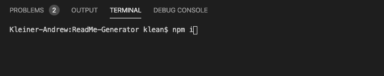
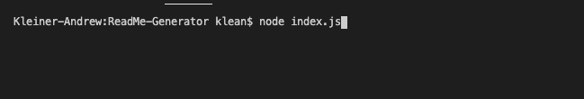
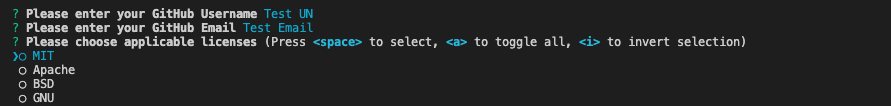
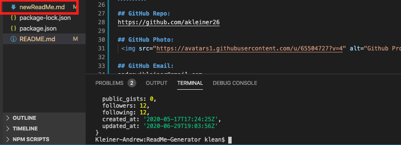
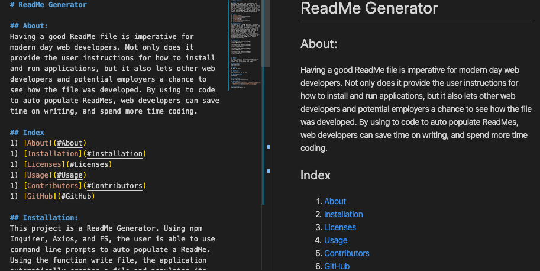
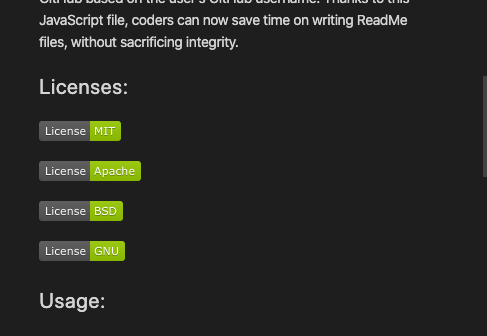
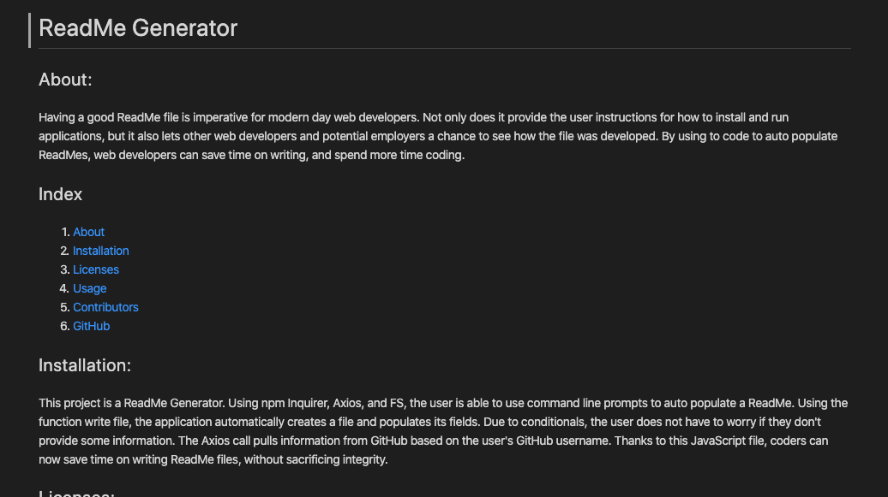

# ReadMe Generator

## About:
Having a good ReadMe file is imperative for modern day web developers. Not only does it provide the user instructions for how to install and run applications, but it also lets other web developers and potential employers a chance to see how the file was developed. By using to code to auto populate ReadMes, web developers can save time on writing, and spend more time coding.

This project is a ReadMe Generator. Using npm Inquirer, Axios, and FS, the user is able to use command line prompts to auto populate a ReadMe. Using the function write file, the application automatically creates a file and populates its fields. Due to conditionals, the user does not have to worry if they don't provide some information. The Axios call pulls information from GitHub based on the user's GitHub username. Thanks to this JavaScript file, coders can now save time on writing ReadMe files, without sacrificing integrity.

## Index
1) [About](#About)
1) [Installation](#Installation)
2) [Usage](#Usage)
3) [Contributors](#Contributors)
4) [GitHub](#GitHub)
5) [Screenshots](#Screenshots)

## Installation:
In order to install all necessary applications and folders, please enter "npm i" into your command line while in the root folder.

## Usage:
The application will run itself if you enter node index.js in your command line while in the root folder.

## Contributors:
Andrew Kleiner

## GitHub Username:
akleiner26

## GitHub Repo:
https://github.com/akleiner26

## GitHub Photo:
 

## GitHub Email:
andrewjkleiner@gmail.com

## Screenshots
### Install

### Run

###  Prompts

### Generated File

### Populated ReadMe

### Badges

### Final Product

